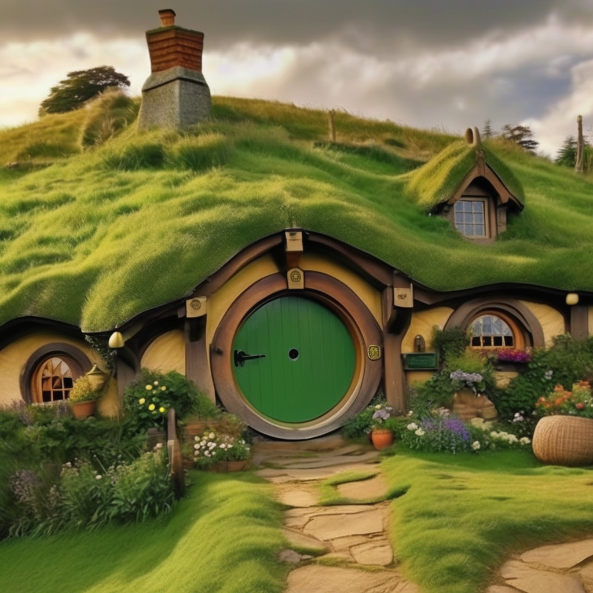
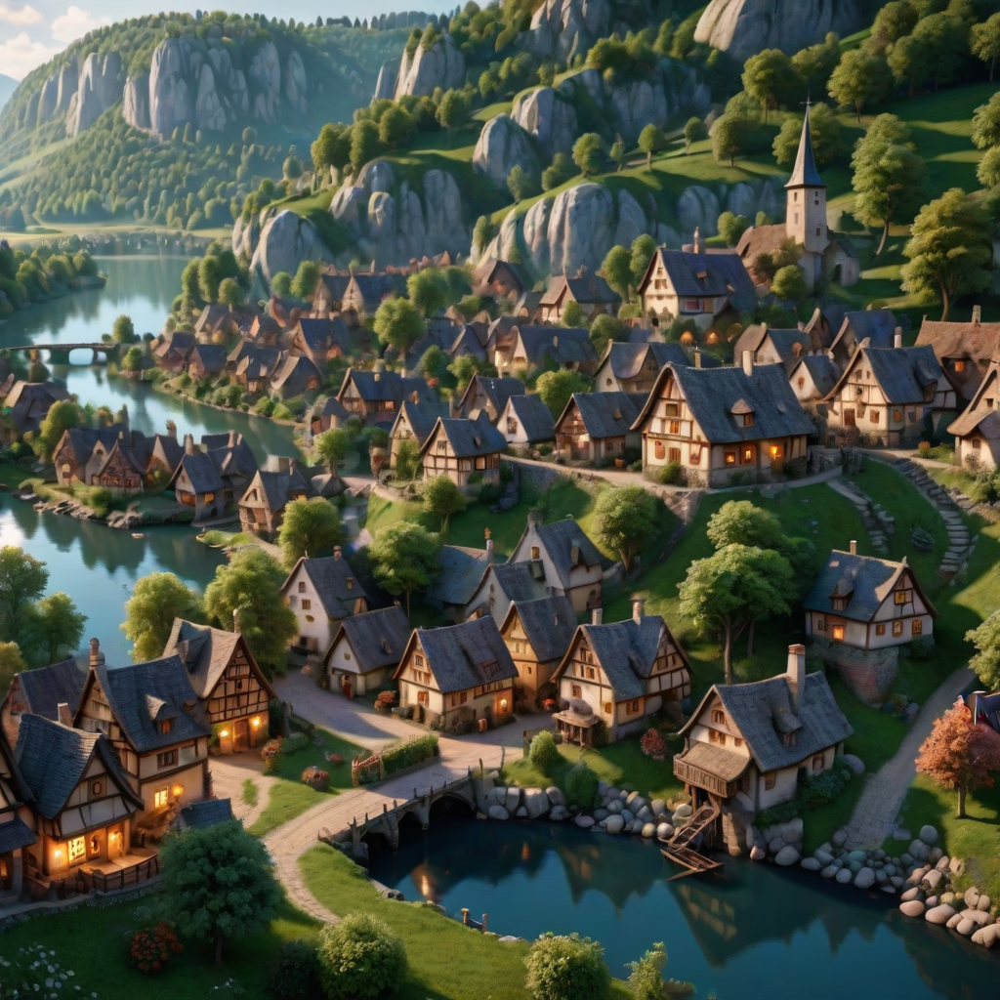

# Diffusers Library Usage Guide

# Summary
This guide introduces the use of the Diffusers library, a powerful tool for text-to-image generation, leveraging Hugging Face models. It covers the basics of downloading models, utilizing multiple GPUs for performance enhancement, and understanding essential parameters for effective pipeline configuration.

1. Introduction to Diffusers Libraries
2. Diffusers provides access to pretrained diffusion models for various natural language processing tasks, including text-to-image generation.
3. Downloading Models
4. Models can be sourced from both Hugging Face and Civitai repositories, broadening the scope of available models for diverse tasks.
5. Utilizing Multiple GPUs
6. Maximize performance by leveraging the computational power of multiple GPUs. In Kaggle, this is particularly useful, where multiple GPUs with ample memory are available for use.

# Code
Installation
To incorporate Diffusers and its dependencies into your Kaggle notebook environment, execute the following commands in a code cell:

```python
# !pip install transformers #redundant
!pip install diffusers accelerator  # Install the Diffusers library for pretrained diffusion models 
!apt -y install -qq aria2  # Install aria2 for efficient file downloads
```

# AutoPipelines 
It is a generic, task-first pipeline that lets you focus on the task. The AutoPipeline automatically detects the correct pipeline class to use

```python
# Import necessary classes and modules
from diffusers import AutoPipelineForText2Image, StableDiffusionPipeline
import torch
```

```python
# Create or Define pipeline
pipeline = AutoPipelineForText2Image.from_pretrained(
    "stabilityai/stable-diffusion-xl-base-1.0",
    use_safetensors=True,
    torch_dtype=torch.float16,
    variant="fp16"
)
```
# Load pipeline into GPU
```python
pipeline.to("cuda")
```

Understanding Basic Parameters
Key parameters such as prompt, height, width, guidance scale, and number of inference steps significantly influence the quality and characteristics of generated images.
```python
# Define parameters
prompt = "(Bag end the shire city hobbiton hobbit village lord of rings movie  Peter Jackson movie beautiful nature landscape high quality, realistic"
height = 1024
width = 1024
guidance_scale = 7.5
num_inference_steps = 50
negative_prompt = "bad image, low res, worst quality, animated, blurry"
```
#Genearating image
```python
# Generate image
image = pipeline(
    prompt=prompt,
    height=height,
    width=width,
    guidance_scale=guidance_scale,
    num_inference_steps=num_inference_steps,
)
```
```python
# Display image
image.images[0]
```

# Loading another model into second
DreamshaperXL turbo from Huggingface 
```python
# Download DreamShaperXL model
!aria2c --console-log-level=error -c -x 16 -s 16 -k 1M https://civitai.com/api/download/models/333449 -d /kaggle/working -o DreamShaperXL.safetensors
```
```python
# Load pipeline from the directory
pipe = StableDiffusionXLPipeline.from_single_file(
        "/kaggle/working/DreamShaperXL.safetensors",
        use_safetensors=True,
        torch_dtype=torch.float16,
    ).to("cuda:1")
```
```python
# Define parameters for DreamShaper
prompt1 = "a fairytale village on the riverside, high res, high quality, realistic, 8K, UHD,landscape"
guidance_scale1 = 2
num_inference_steps1 = 8
```
```python
# Generate image using DreamShaperXL
image1 = pipe(prompt=prompt1, guidace_scale=guidance_scale1, num_inference_steps=num_inference_steps1).images[0]
image1
```

